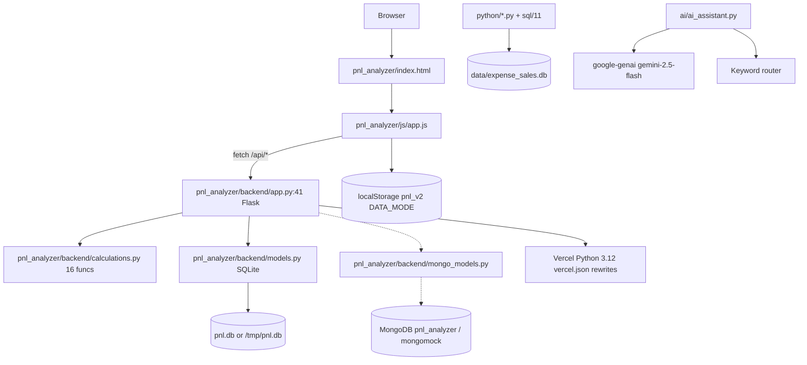
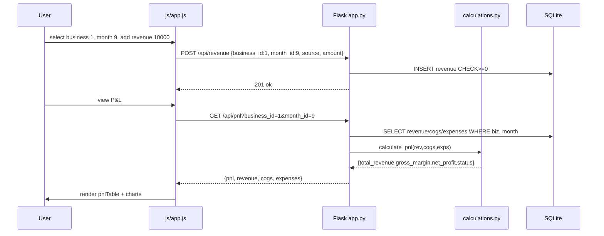

# 03 — System Architecture

## Overall
Monolith Flask + vanilla JS SPA, single DB file, optional Mongo, no workers. Vercel serverless for SaaS; local file DB for dev.



## High-Level Request Flow (P&L)



## Frontend
- Entry `pnl_analyzer/index.html:1` loads `css/style.css`, `js/app.js:1`, CDNs `chart.js@4.4.0`, `jspdf`. 10 pages via `data-page`, `renderAll()` switches. State in `localStorage pnl_v2` (`STORAGE_KEY`) + `API_BASE=http://localhost:5000` for SQL/Mongo mode.

## Backend
- One Flask `app` with 35 routes (see `05_API`). Business logic in `calculations.py` pure functions; `models.py` handles connection + seeding; `mongo_models.py` mirrors with `_USE_MOCK`.

## Data & Storage
- SQLite `pnl_analyzer/backend/pnl.db` (8 tables, WAL) or `/tmp/pnl.db` on `VERCEL=1`. Mongo `pnl_analyzer` optional. Browser `localStorage` for `Local` mode. Legacy `data/expense_sales.db` star schema separate.

## AI Component
```
User query → ai_assistant.py ask() → google.genai generate_content(gemini-2.5-flash) with FINANCIAL_ANALYST_SYSTEM_PROMPT+context → offline _offline_response keyword fallback → markdown report
```
No RAG/vector DB.

## Deployment
- **Local:** `python pnl_analyzer/backend/app.py :5000` + `http.server 8000 --directory pnl_analyzer`.
- **Vercel:** `pyproject.toml:16` `pnl_analyzer.backend.app:app` (Root `.`) + `pnl_analyzer/pyproject.toml:16` `backend.app:app` (Root `pnl_analyzer`), `vercel.json:3` rewrites `/api` → `app.py`, `outputDirectory` for static. Python `>=3.10` (3.12 runtime).

## Diagrams: Deployment Flow
```mermaid
graph LR
    Git[git push main] --> Vercel[Vercel build: uv lock Python 3.12]
    Vercel --> PyProj[pyproject.toml entrypoint]
    Vercel --> Func[Serverless Flask /api/*]
    Vercel --> Static[pnl_analyzer/index.html via outputDirectory]
    Func --> SQLiteTmp[/tmp/pnl.db]
```
