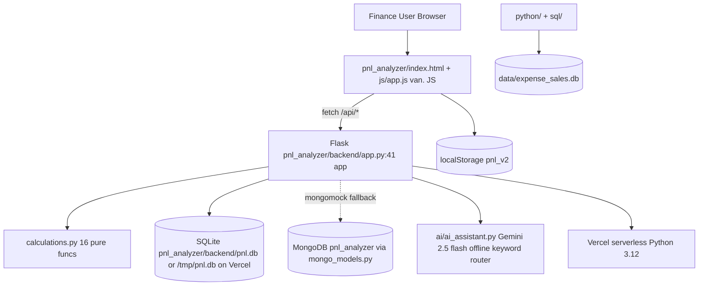

# P&L Analyzer — Startup Finance OS — Documentation Command Center

**Purpose:** This `docs/` system makes the repository transferable to a new team without relying on the original developer. It documents what the product does, how it is built, how to run it, and how to safely change it.

**Repository:** `P-L-Analyzer-Startup-Finance-OS` — dual system: (1) **P&L SaaS** (`pnl_analyzer/`) — Flask + vanilla JS finance OS; (2) **AI-Expense-Sales-Analyzer** (`python/`, `sql/`, `powerbi/`, `ai/`) — data pipeline + Power BI.

**Current deployment:** Vercel — `pnl_analyzer` renamed from `pnl-analyzer` (underscore required for `pnl_analyzer.backend.app:app`), Python 3.12, `outputDirectory: pnl_analyzer`. SQLite fallback to `/tmp/pnl.db` on Vercel read-only FS.

> **Important warnings (read first):**
> - **No authentication** — `users` table exists but no passwords/JWT; frontend role selector is client-side only. Do not expose publicly without adding auth.
> - **SQLite on Vercel is ephemeral** — `/tmp` is wiped on cold start; data does not persist across deploys. MongoDB or external DB required for persistence.
> - **CORS allow-all** — `CORS(app)` in `pnl_analyzer/backend/app.py:42`.
> - **Folder renamed** — `pnl_analyzer` (underscore) is correct. `pnl-analyzer` no longer exists; update any local scripts/docs referencing hyphen.

## Start Here

**New to the project?** Follow your role:

### For Non-Technical Stakeholders
`00_Project_Overview.md` → `01_Product_and_Business_Overview.md` → `13_User_Guide.md` → `12_Known_Issues_and_Limitations.md`

### For Developers
`00_Project_Overview.md` → `03_System_Architecture.md` → `06_Folder_and_Codebase_Guide.md` → `07_Local_Setup_Guide.md` → `08_Environment_Configuration.md` → `20_Development_and_Contribution.md`

### For QA
`02_Requirements.md` → `13_User_Guide.md` → `10_Testing_and_Quality.md` → `12_Known_Issues_and_Limitations.md` → `11_Troubleshooting.md`

### For DevOps / Operations
`03_System_Architecture.md` → `08_Environment_Configuration.md` → `09_Deployment_Guide.md` → `21_Operations_and_Monitoring.md` → `23_Data_Lifecycle_Backup_and_Recovery.md`

### For Future Maintainers
Read `docs/README.md` → `00_Project_Overview.md` → `03_System_Architecture.md` → `07_Local_Setup_Guide.md` → `20_Development_and_Contribution.md` → `09_Deployment_Guide.md` → `12_Known_Issues_and_Limitations.md` → `16_Future_Roadmap.md`

## Document Index

| # | Document | What it answers |
|---|----------|-----------------|
| 00 | `00_Project_Overview.md` | What is it, why exists, tech stack, status, quick-start |
| 01 | `01_Product_and_Business_Overview.md` | Non-technical: users, journeys, value |
| 02 | `02_Requirements.md` | Functional/non-functional, roles, validations |
| 03 | `03_System_Architecture.md` | Diagrams, request flows, component map |
| 04 | `04_Data_Model.md` | ERD, tables, SQLite + Mongo, relationships |
| 05 | `05_API_Documentation.md` | 35 routes, request/response, errors |
| 06 | `06_Folder_and_Codebase_Guide.md` | Directory map, file responsibilities |
| 07 | `07_Local_Setup_Guide.md` | Reproducible setup from clean machine |
| 08 | `08_Environment_Configuration.md` | Every `MONGO_URI` etc. |
| 09 | `09_Deployment_Guide.md` | Vercel + local, build, rollback |
| 10 | `10_Testing_and_Quality.md` | `test_calculations.py`, manual checks |
| 11 | `11_Troubleshooting.md` | 8 common failures with diagnosis |
| 12 | `12_Known_Issues_and_Limitations.md` | Risks, debt, missing infra |
| 13 | `13_User_Guide.md` | Non-technical step-by-step for finance user |
| 14 | `14_Admin_Guide.md` | Admin tasks (limited — no real admin) |
| 15 | `15_Change_Log.md` | Git history + recent fixes |
| 16 | `16_Future_Roadmap.md` | TODOs vs proposals |
| 17 | `17_Security_and_Privacy.md` | Implemented vs missing controls |
| 18 | `18_External_Integrations.md` | MongoDB, Gemini, CDNs |
| 19 | `19_Error_Handling_and_Resilience.md` | Validation, fallbacks, no retries |
| 20 | `20_Development_and_Contribution.md` | Conventions, safe/dangerous changes |
| 21 | `21_Operations_and_Monitoring.md` | Logs, health checks, no APM |
| 22 | `22_Performance_and_Scalability.md` | Bottlenecks, expensive ops |
| 23 | `23_Data_Lifecycle_Backup_and_Recovery.md` | Creation → retention → no backup |
| 24 | `24_Release_and_Versioning.md` | Git push → Vercel, no semantic versioning |
| 25 | `25_Documentation_Maintenance.md` | How to keep docs accurate |
| AI | `ai/README.md` + `ai/01_AI_Architecture.md` etc. | Gemini + offline fallback, prompts, RAG=Not Applicable |
| D | `decisions/README.md` | ADRs (Flask, underscore, /tmp) |

## Architecture Overview (1-minute)



**Key links:**
- API entry: `pnl_analyzer/backend/app.py:41` `app = Flask(__name__)`
- Calc engine: `pnl_analyzer/backend/calculations.py:1`
- DB schema: `pnl_analyzer/backend/models.py:11` `SCHEMA`
- Frontend entry: `pnl_analyzer/index.html:1` → `js/app.js:1` `API_BASE`
- AI: `ai/ai_assistant.py:1` `FinancialAIAssistant`
- Deploy: `pyproject.toml:16` `entrypoint = "pnl_analyzer.backend.app:app"`, `vercel.json:3`

## Development Entry Point
```bash
pip install -r pnl_analyzer/backend/requirements.txt
python pnl_analyzer/backend/app.py  # :5000
python -m http.server 8000 --directory pnl_analyzer  # open http://localhost:8000
```

## Deployment Entry Point
```bash
git push origin main  # Vercel auto-deploys from pyproject.toml requires-python >=3.10
```

## Documentation Status
- **Last audited:** 2026-09-23 against `main@d541ddf` + `pyproject.toml` `>=3.10` + `/tmp` DB fix.
- **Accuracy:** Evidence-traced to source files listed in each doc. Unverified = labeled.
- **Maintenance:** See `25_Documentation_Maintenance.md`.

---

## Handover Checklist

- [ ] Application purpose documented (`00`, `01`)
- [ ] Major features documented (`01`, `13`)
- [ ] User workflows documented (`01`, `13`)
- [ ] Architecture documented (`03` with Mermaid)
- [ ] Database documented (`04` ERD)
- [ ] APIs documented (`05` 35 routes)
- [ ] Setup verified (`07` reproducible)
- [ ] Environment variables documented (`08`)
- [ ] Deployment documented (`09` Vercel + local)
- [ ] Testing documented (`10` — 5 unit tests)
- [ ] Known issues documented (`12`)
- [ ] Security documented (`17` — CORS allow-all, no auth)
- [ ] External integrations documented (`18` Mongo, Gemini)
- [ ] Operational procedures documented (`21`)
- [ ] Backup/recovery status documented (`23` — No backup)
- [ ] AI architecture documented (`ai/` — Gemini + offline)
- [ ] Technical debt documented (`12`, `16`)
- [ ] Future work documented (`16`)
- [ ] Root README links to `docs/README.md`
- [ ] Documentation reviewed for stale/conflicting info (audit 2026-09-23)
