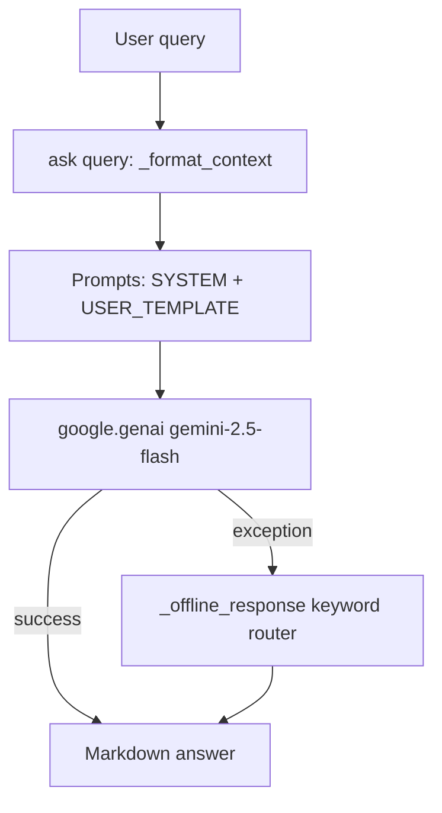

# AI 01 — Architecture

## Provider & Model
- **Implemented:** `google.genai` `gemini-2.5-flash` via `ai_assistant.py:42` `Client(api_key).models.generate_content(model='gemini-2.5-flash', contents=[...])`.
- **Not Applicable:** OpenAI, Anthropic, local LLM.

## Configuration
- `ai_assistant.py:12` `FinancialAIAssistant(api_key, provider='gemini')` — `api_key` passed directly, no env lookup. `python/data_loader.py` `load_processed_data()` + `python/eda.py` `generate_eda_summary()` provide context.
- No `temperature`, `max_tokens`, `top_p` config — defaults.

## Context Construction
- `_format_context()` builds string:
```
Total Revenue: 14494612.58
Total Expenses: 8196398
Net Profit: 3274064
Profit Margin: 22.59%
Transactions: 1200
Category summary...
```
from `data/processed/summary_metrics.json` or `eda.generate_eda_summary()`.

## Flow


## Conversation State
**Not Applicable:** No memory, no vector store, single-turn.

## Evidence
`ai/ai_assistant.py:38` `FINANCIAL_ANALYST_SYSTEM_PROMPT`, `ai/prompts.py:1`, `python/eda.py:1`.
